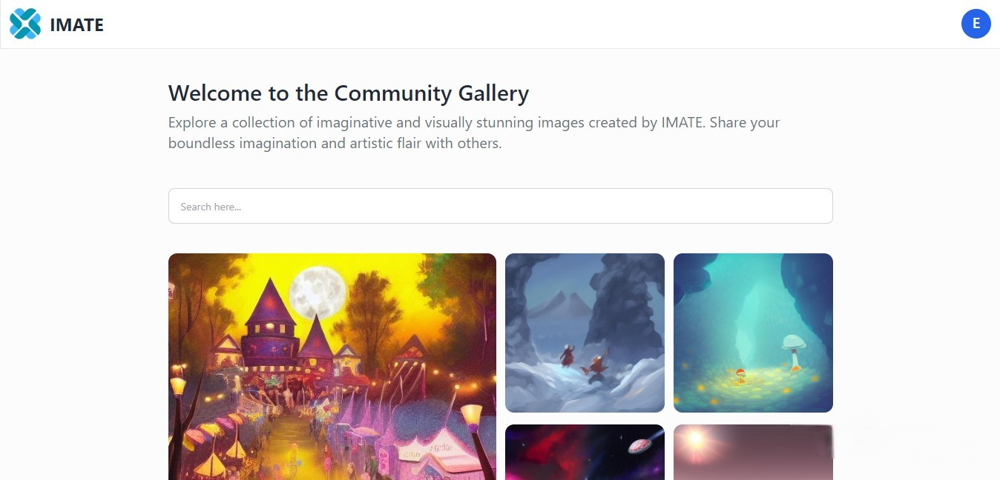

<h1 align="center">
  <a href="https://github.com/Maru-Yasa/SEVIMA-Vidya-Learn">
    <!-- Please provide path to your logo here -->
    
  </a>
</h1>

<b>IMATE</b> is a website that can produce images. You can imagine an image and share it with others. With Imate, you have the ability to create visualizations of various concepts and ideas, and easily share the results with your friends and colleagues.

## Tech Stack

 - MongoDB 
 - NodeJs with Express
 - HuggingFace Api
 - React powered by vite
 - TailwindCSS
